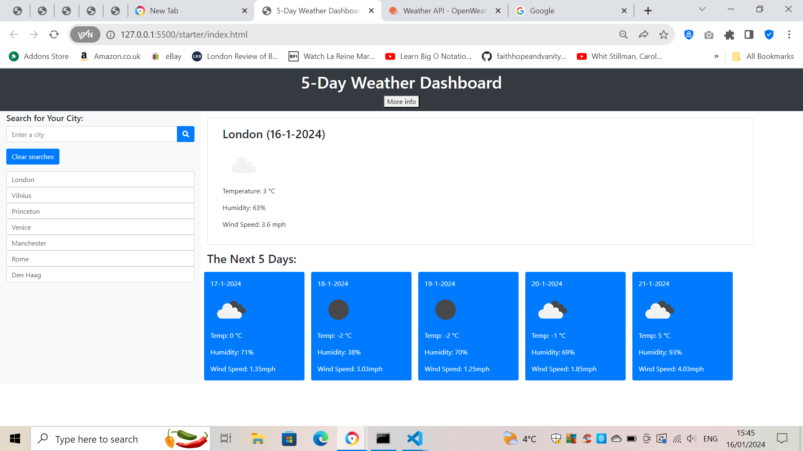

# Check-the-Weather

"Shiver in my bones just thinking about the weather!"

This is a weather app that tells you the temperature, humidity and windspeed of your chosen city, for today and for the next five days.

It's powered by OpenWeatherMap's APIs. They provide several, each with their own purpose. For example, 'Current Weather''s is pretty self-explanatory, as is 'Daily Forecast 16 Days''s. Additionally, 'UV Index' and 'Road Risk' are great for helping stay safe.

Pictured: my home city and some of my favourites I've been to.

I also experimented with using a 'popover' modal in my html as I think it's a very snazzy new(-ish) feature - to make it go away, just click the button again.

OpenWeather provide emojis as part of their updates, so you can integrate dynamically-changing icons that match the weather info.

https://faithhopeandvanity.github.io/Check-the-Weather/

I used [this video by Bro Code](https://www.youtube.com/watch?v=VaDUGPMjzOM) for additional help in getting to grips with the API.
[Guide to the APIs with links to respective documentation.](https://openweathermap.org/api)
[I also cross-examined returned and parsed data with OpenWeather's own forecast app to check that the data and units were correct!](https://openweathermap.org/)

